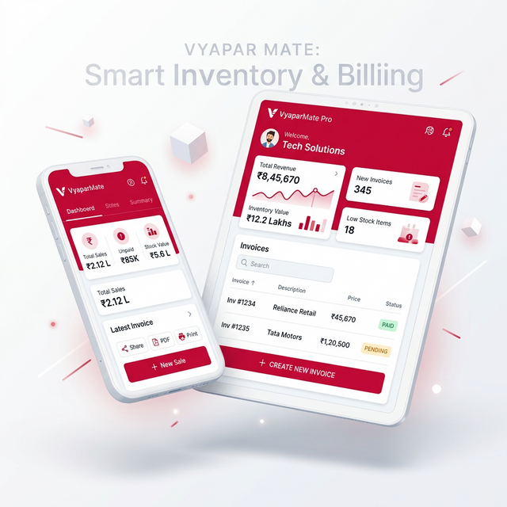

<div align="center">
  
  <h1>📦 StockFlow</h1>
  <p><strong>Advanced Inventory & Billing Management System</strong></p>

  <p>
    
    
    
    
  </p>
</div>

<br />



> **StockFlow** is a modern, responsive, and robust SaaS-style web application built to streamline logistical operations. From tracking stock viability and managing vendors, to interpreting high-level business analytics, StockFlow provides a premium interface for both Administrators and internal Staff.

---

## ✨ System Features

### 🛡️ Role-Based Access Control
- **Administrator**: Full privileges. Manage global inventory, modify categories, handle purchase orders, invite new staff, and view sensitive reporting.
- **Staff Member**: View-only privileges for the product catalog. Staff undergo an enforced "Setup Profile" validation upon registration.

### 📊 Real-Time Analytics Dashboard
- Clean, immersive metric cards for instant business health checks (Low Stock Alerts, Total Appraised Value).
- Interactive **Recharts** integration (Bar & Pie charts) depicting categorical stock distribution.

### 📦 Comprehensive Logistics Engine
- **Product & Category Hub**: Advanced CRUD management utilizing dynamic floating modals and smart-search filters.
- **Stock Manager Ledger**: Log explicit `[ + ] ADD` or `[ - ] REMOVE` tracking histories instead of just updating raw numbers. 
- **Purchase Orders (Procurement)**: Assemble itemized vendor purchases that mathematically calculate totals.

### 📝 Automated Reporting & Exporting
- Instantly generate tabular valuation digests (Inventory Values, Low Stock, Purchasing Histories).
- Single-click **CSV Extractor** directly downloads tailored business intelligence models.

### 📨 Public Landing Page & Contact Inbox
- **High-Conversion Landing**: Features an eye-catching hero 3D perspective, pricing guides, and animated blobs.
- **Admin Inbox**: External guests can seamlessly submit inquiries that are reliably routed into an internal "Messages" table for easy Admin review.

---

## 🛠️ Technology Stack

| Architecture Layer | Technology |
| ----------------- | ---------- |
| **Frontend Framework** | React.js (Vite) |
| **Styling & UI Components** | Vanilla CSS, Bootstrap 5, React-Icons |
| **Data Visualizations** | Recharts (Responsive SVG Charts) |
| **Backend REST API** | Native PHP 8.x (PDO Object-Oriented) |
| **Database Structure** | MySQL (Relational Cascading DB) |
| **Authentication** | Custom Bearer Token Auth |

---

## 📸 Application Screenshots

<div align="center">
  
  <p><em>Modern, clean, and interactive overview of total physical availability.</em></p>
</div>

---

## ⚙️ Installation & Local Setup

### 1. Prerequisites
- **XAMPP / WAMP** or any local PHP server environment.
- **Node.js** (v18+) and **npm**.

### 2. Database Initialization
1. Open XAMPP and start the **MySQL** and **Apache** modules.
2. Navigate to `phpMyAdmin` (typically `http://localhost/phpmyadmin`).
3. Create a new empty database.
4. Import the `database/inventory.sql` file provided in this repository to instantly construct schemas and the **Default Admin Account**.

> **Default Admin Credentials:**
> - Email: `admin@example.com`
> - Password: `admin123`

### 3. Backend (API) Setup
1. Open up a terminal at the root project directory.
2. Start PHP's built-in rapid server targeting the `backend` folder via port `8000`:
   ```bash
   php -S localhost:8000 -t backend
   ```

### 4. Frontend (React) Setup
1. Open a *second* terminal window and enter the React workspace:
   ```bash
   cd frontend
   ```
2. Rapidly install dependencies:
   ```bash
   npm install
   ```
3. Start the Vite development framework:
   ```bash
   npm run dev
   ```
4. Access the seamless UI via `http://localhost:5173/`.

---

## 📁 System Architecture (Directory Structure)
```text
📦 inventory-system
 ┣ 📂 backend                 # PHP API Layer
 ┃ ┣ 📂 api                   # index.php (Central Router)
 ┃ ┣ 📂 config                # Database connection
 ┃ ┣ 📂 controllers           # Business logic & Route Handlers
 ┃ ┣ 📂 models                # PDO Relational Data Classes
 ┃ ┗ 📂 services              # Internal utilities (Mailer config)
 ┣ 📂 database                # Schema definitions
 ┃ ┗ 📜 inventory.sql         # Base relational tables
 ┗ 📂 frontend                # React Interface Layer
   ┣ 📂 public                # Static graphical assets & uploads
   ┣ 📂 src                   
   ┃ ┣ 📂 components          # Reusable wrappers (Navbar, Sidebar, AuthGuard)
   ┃ ┣ 📂 pages               # Heavy UI Views (Dashboards, Products, Reports)
   ┃ ┣ 📂 services            # Axios API singletons (api.js, auth.js)
   ┃ ┣ 📜 App.jsx             # React-Router DOM initialization
   ┃ ┗ 📜 index.css           # Global custom SaaS variables
```

---

<div align="center">
    <p>Engineered with 💡 and modern web principles.</p>
</div>
